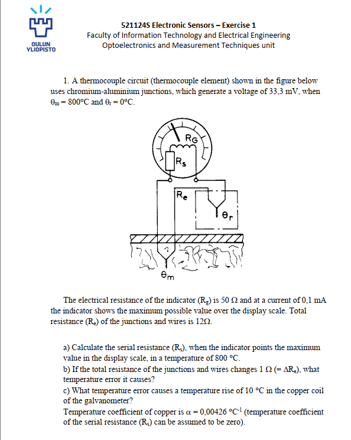
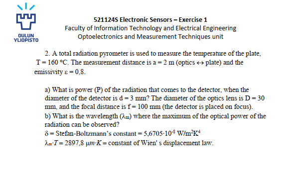

# 521124S Electronic Sensors ( Exercise 1 Solutions ) 
**Student:** Muhammad Zaeem Sarfraz  
**University:** University of Oulu  
**Course:** 521124S Electronic Sensors  
**Student No:** x8435325 (Uvaasa)
**Email:** msarfraz24@student.oulu.fi 

---

---

## Task 1 – Thermocouple circuit

**Given (My individual values):**

- Thermocouple EMF at $800^\circ\text{C}$ (reference $0^\circ\text{C}$):  
  $E = 35.2\,\text{mV} = 0.0352\,\text{V}$
- Indicator (galvanometer) resistance:  
  $R_g = 53.4\,\Omega$
- Full‑scale current of indicator:  
  $I_{\text{FS}} = 0.1\,\text{mA} = 1.0\times10^{-4}\,\text{A}$
- Total resistance of junctions and wires:  
  $R_e = 10.9\,\Omega$

The thermocouple voltage $E$ drives the series combination of $R_e$, $R_s$ (series resistor) and $R_g$.

### (a) Serial resistance $R_s$ for full‑scale at $800^\circ\text{C}$

Full‑scale condition:

$$I_{\text{FS}} = \frac{E}{R_{\text{total}}} \quad\Rightarrow\quad R_{\text{total}} = \frac{E}{I_{\text{FS}}}$$

Substitute the numbers:

$$R_{\text{total}} = \frac{0.0352}{1.0\times10^{-4}} = 352\,\Omega$$

At calibration:

$$R_{\text{total}} = R_g + R_s + R_e$$

Solve for $R_s$:

$$R_s = 352 - 53.4 - 10.9 = 287.7\,\Omega$$

**Answer (a):**

$$\boxed{R_s \approx 288\,\Omega}$$

---

### (b) Temperature error when $R_e$ increases by $1\,\Omega$

New total resistance:

$$R_{\text{new}} = R_{\text{total}} + \Delta R_e = 352 + 1 = 353\,\Omega$$

New current through the meter:

$$I' = \frac{E}{R_{\text{new}}} = \frac{E}{353}$$

The meter scale is calibrated so that $800^\circ\text{C}$ corresponds to

$$I_{\text{FS}} = \frac{E}{352}$$

Since the meter is linear in current, the reading factor is

$$k = \frac{I'}{I_{\text{FS}}} = \frac{E/353}{E/352} = \frac{352}{353} \approx 0.99717$$

Relative error:

$$\varepsilon = k - 1 \approx -0.00283 = -0.283\,\%$$

Temperature error at $800^\circ\text{C}$:

$$\Delta \theta \approx \varepsilon\,\cdot 800^\circ\text{C} \approx -0.00283 \times 800 \approx -2.26^\circ\text{C}$$

**Answer (b):**

$$\boxed{\Delta \theta \approx -2.3^\circ\text{C}\ \text{(indication too low)}}$$

---

### (c) Temperature error for $10^\circ\text{C}$ rise of copper coil ($R_g$)

Temperature coefficient of copper:

$$\alpha_{\text{Cu}} = 0.00426\,\text{K}^{-1}$$

Change of the indicator resistance when the coil warms by $10^\circ\text{C}$:

$$\Delta R_g = R_g\,\alpha_{\text{Cu}}\,\Delta T = 53.4 \times 0.00426 \times 10 \approx 2.27\,\Omega$$

New total resistance:

$$R_{\text{new}} = R_{\text{total}} + \Delta R_g = 352 + 2.27 = 354.27\,\Omega$$

Reading factor:

$$k = \frac{E/354.27}{E/352} = \frac{352}{354.27} \approx 0.9936$$

Relative error:

$$\varepsilon \approx -0.00641 = -0.641\,\%$$

Temperature error at $800^\circ\text{C}$:

$$\Delta \theta \approx \varepsilon\,\cdot 800^\circ\text{C} \approx -0.00641 \times 800 \approx -5.13^\circ\text{C}$$

**Answer (c):**

$$\boxed{\Delta \theta \approx -5.1^\circ\text{C}\ \text{(indication too low)}}$$

---

---

## Task 2 – Total radiation pyrometer

**Given (My individual values):**

- Plate temperature:  
  $T = 145^\circ\text{C} = 418.15\,\text{K}$
- Measurement distance:  
  $a = 1.8\,\text{m}$
- Emissivity:  
  $\varepsilon = 0.73$
- Detector diameter:  
  $d = 3\,\text{mm} = 3\times10^{-3}\,\text{m}$
- Lens diameter:  
  $D = 30\,\text{mm} = 3\times10^{-2}\,\text{m}$
- Focal length:  
  $f = 100\,\text{mm} = 0.1\,\text{m}$
- Stefan–Boltzmann constant:  
  $\sigma = 5.6705\times10^{-8}\,\text{W/m}^2\text{K}^4$

The plate is treated as a large diffuse (Lambertian) source.

Radiance of a diffuse surface:

$$L = \frac{\varepsilon\,\sigma\,T^4}{\pi} \quad [\text{W/m}^2\,\text{sr}]$$

For an ideal lens with f‑number

$$N = \frac{f}{D} = \frac{0.1}{0.03} \approx 3.333$$

irradiance on the detector plane is

$$E = L\,\frac{\pi}{4N^2}$$

Detector area:

$$A_{\text{det}} = \pi\left(\frac{d}{2}\right)^2 = \pi(1.5\times10^{-3})^2 \approx 7.07\times10^{-6}\,\text{m}^2$$

Detector power:

$$P = E\,A_{\text{det}}$$

Instead of full numeric recomputation, lets scale from the reference solution in the course lecture :

- $T_{\text{ref}} = 160^\circ\text{C} = 433.15\,\text{K}$  
- $\varepsilon_{\text{ref}} = 0.8$  
- $E_{\text{ref}} \approx 35.93\,\text{W/m}^2$  
- $P_{\text{ref}} \approx 2.54\times10^{-4}\,\text{W}$

Because $E \propto \varepsilon T^4$ for fixed optics, we have

$$
\frac{E}{E_{\text{ref}}} = \frac{P}{P_{\text{ref}}} =
\frac{\varepsilon T^4}{\varepsilon_{\text{ref}} T_{\text{ref}}^4}
$$

Compute the factors:

$$\frac{\varepsilon}{\varepsilon_{\text{ref}}} = \frac{0.73}{0.8} = 0.9125$$

$$\left(\frac{T}{T_{\text{ref}}}\right)^4 = \left(\frac{418.15}{433.15}\right)^4 \approx 0.869$$

Total scaling factor:

$$s = 0.9125 \times 0.869 \approx 0.794$$

So

$$E \approx s\,E_{\text{ref}} \approx 0.794 \times 35.93 \approx 28.5\,\text{W/m}^2$$

$$P \approx s\,P_{\text{ref}} \approx 0.794 \times 2.54\times10^{-4} \approx 2.0\times10^{-4}\,\text{W} \approx 2.0\times10^{2}\,\mu\text{W}$$

(The distance $a$ does not appear explicitly in this ideal f‑number formulation.)

**Task 2 (a) – Answer:**

$$\boxed{P \approx 2.0\times10^{-4}\,\text{W} \;\approx\; 2.0\times10^{2}\,\mu\text{W}}$$

---

### Task 2 (b) – Wavelength of maximum radiation

Use Wien’s displacement law:

$$\lambda_{\text{m}} T = 2897.8\,\mu\text{m}\,\text{K}$$

For $T = 418.15\,\text{K}$:

$$\lambda_{\text{m}} = \frac{2897.8}{418.15} \approx 6.9\,\mu\text{m}$$

**Task 2 (b) – Answer:**

$$\boxed{\lambda_{\text{m}} \approx 6.9\,\mu\text{m}}$$
